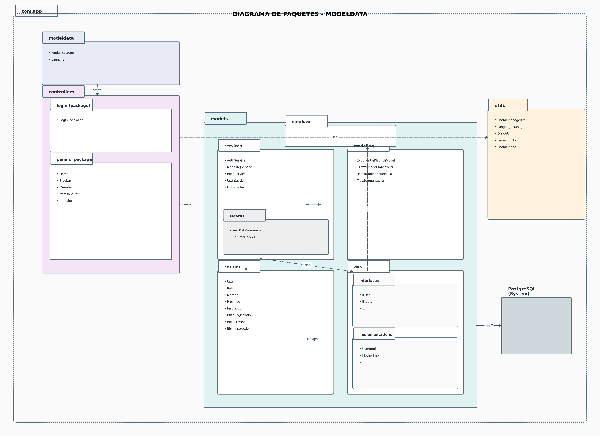

# MANUAL TÉCNICO

## Sistema de Análisis, Modelado Matemático y Visualización de Datos de Natalidad en Ecuador

---

**Autores:**
- William Chisag
- Licet Ibarra

**Institución:** Escuela Superior Politécnica de Chimborazo (ESPOCH) – Sede Orellana  
**Carrera:** Tecnologías de la Información  
**Semestre:** Tercer semestre (PAO)  
**Tipo de Proyecto:** Proyecto académico-técnico con enfoque profesional

**Versión:** 1.0  
**Fecha:** Enero 2026

---

## 1. Introducción

### 1.1 Propósito del Manual

Este manual técnico documenta de forma integral el sistema de análisis de datos de natalidad en Ecuador, desarrollado como proyecto académico-técnico. El documento proporciona información detallada sobre la arquitectura, diseño, implementación y operación del sistema.

### 1.2 Alcance del Documento

El manual cubre:
- Arquitectura y diseño del sistema
- Especificaciones técnicas de módulos
- Modelado matemático mediante ecuaciones diferenciales ordinarias (EDO)
- Gestión de base de datos PostgreSQL
- Procesos de instalación, configuración y mantenimiento
- Metodología de desarrollo aplicada (Scrum)

### 1.3 Público Objetivo

- Desarrolladores que requieran mantener o extender el sistema
- Arquitectos de software para evaluación técnica
- Académicos e investigadores interesados en análisis demográfico
- Evaluadores del proyecto académico

### 1.4 Visión General del Sistema

El sistema **ModelData** es una aplicación de escritorio desarrollada en Java con JavaFX que permite:

- **Gestión de datos:** Carga, validación y almacenamiento de registros de nacimientos
- **Modelado matemático:** Aplicación de modelos EDO para proyección de tendencias
- **Análisis estadístico:** Cálculo de métricas (R², MAE, RMSE) y análisis comparativo
- **Visualización:** Gráficos interactivos de series temporales y comparativas
- **Consolidación:** Agregación de microdatos en estadísticas anuales por provincia y nivel de instrucción

---

## 2. Contexto y Descripción del Proyecto

### 2.1 Problema que Aborda el Sistema

El Instituto Nacional de Estadística y Censos (INEC) de Ecuador publica datos de natalidad anualmente. Sin embargo, estos datos requieren:

1. **Procesamiento:** Transformación de datos brutos en información útil
2. **Modelado:** Proyección de tendencias mediante técnicas matemáticas
3. **Comparación:** Análisis multidimensional por provincia y nivel educativo materno
4. **Visualización:** Representación gráfica clara para toma de decisiones

### 2.2 Justificación Técnica y Académica

**Técnica:**
- Aplicación práctica de ecuaciones diferenciales ordinarias en demografía
- Implementación del patrón DAO para abstracción de datos
- Uso de arquitectura MVC para separación de responsabilidades
- Gestión profesional de base de datos relacional

**Académica:**
- Integración de conocimientos matemáticos y programación
- Desarrollo de competencias en ingeniería de software
- Aplicación de metodologías ágiles (Scrum)
- Generación de documentación técnica profesional

### 2.3 Alcance Funcional

**Funcionalidades Implementadas:**

1. **Autenticación y Seguridad**
   - Sistema de login con contraseñas encriptadas (BCrypt)
   - Gestión de roles de usuario
   - Control de sesión

2. **Gestión de Datos**
   - Registro individual de nacimientos
   - Asociación madre-nacimiento-provincia-instrucción
   - Consulta, modificación y eliminación de registros

3. **Consolidación Estadística**
   - Agregación anual por provincia
   - Agregación anual por nivel de instrucción materna
   - Generación de tablas pivote

4. **Modelado Matemático EDO**
   - Modelo exponencial: N(t) = A·e^(B·t)
   - Estimación de parámetros por regresión lineal
   - Cálculo de métricas de bondad de ajuste (R², MAE, RMSE)
   - Modos de comparación: individual, 1 vs 1, 1 vs N, 1 vs todos

5. **Visualización y Análisis**
   - Gráficos de líneas con series observadas y modeladas
   - Tablas de análisis estadístico
   - Comparativas interactivas
   - Análisis de frecuencias
   - **Exportación de resultados modelados a PDF y CSV**

6. **Configuración**
   - Soporte multiidioma (Español/Inglés)
   - Temas claro/oscuro
   - Configuración de conexión a base de datos

### 2.4 Limitaciones Conocidas

- **Datos históricos:** Sistema limitado a datos disponibles del INEC (1990-2024)
- **Modelo matemático:** Modelo exponencial simple, no considera factores externos
- **Escalabilidad:** Optimizado para datasets de tamaño medio (< 500,000 registros)
- **Plataforma:** Aplicación de escritorio, no incluye versión web

---

## 3. Metodología de Desarrollo (Scrum)

### 3.1 Marco de Trabajo Scrum Aplicado

El proyecto se desarrolló utilizando **Scrum**, framework ágil adaptado al contexto académico:

- **Sprints:** Ciclos de 1-2 semanas
- **Reuniones:** Revisiones semanales de progreso
- **Incrementos:** Cada sprint entregó funcionalidad verificable
- **Retrospectivas:** Mejora continua del proceso

### 3.2 Roles del Proyecto

| Rol | Responsable | Responsabilidades |
|-----|-------------|-------------------|
| **Product Owner** | Equipo (ambos) | Definición de requisitos y prioridades |
| **Scrum Master** | Rotativo | Facilitación del proceso Scrum |
| **Development Team** | William Chisag, Licet Ibarra | Desarrollo, testing, documentación |

### 3.3 Herramientas Utilizadas

**Desarrollo:**
- **IDE:** IntelliJ IDEA / Eclipse
- **Lenguaje:** Java 25
- **Framework UI:** JavaFX 25.0.1
- **Build Tool:** Apache Maven 3.x
- **Librerías principales:**
  1. **JavaFX** 25.0.1: Framework para la interfaz de usuario (Controls, FXML, Web, Swing)
  2. **JFoenix** 9.0.10: Implementación de Material Design para JavaFX
  3. **PostgreSQL JDBC** 42.7.8: Driver de conexión a la base de datos PostgreSQL
  4. **BCrypt** 0.4: Librería para encriptación de contraseñas
  5. **Apache Commons Math** 3.6.1: Librería de utilidades matemáticas y estadísticas
  6. **HikariCP** 5.0.1: Pool de conexiones de alto rendimiento
  7. **SLF4J** 2.0.9: API de logging
  8. **Logback** 1.5.13: Implementación de logging
  9. **OpenPDF** 2.0.3: Generación y exportación de documentos PDF
  10. **JUnit Jupiter** 5.12.1: Framework de pruebas unitarias
**Control de Versiones:**
- **Sistema:** Git
- **Repositorio:** Local con backups periódicos

**Base de Datos:**
- **Motor:** PostgreSQL 18.1
- **Herramienta:** pgAdmin 4, DBeaver

**Diseño:**
- **UML:** Diagrams.net, Python (Graphviz, Matplotlib)

### 3.4 Organización del Trabajo por Sprints

**Sprint 1-2:** Configuración inicial y autenticación
- Configuración Maven y dependencias
- Diseño de base de datos
- Módulo de login y gestión de usuarios

**Sprint 3-4:** Gestión de datos
- CRUD de nacimientos
- Implementación patrón DAO
- Registro de madres y nacimientos

**Sprint 5-6:** Modelado matemático
- Implementación modelo EDO
- Cálculo de parámetros (A, B)
- Métricas estadísticas (R², MAE, RMSE)

**Sprint 7-8:** Visualización
- Gráficos JavaFX LineChart
- Tablas de resultados
- Consolidación de datos

**Sprint 9-10:** Refinamiento y documentación
- Multiidioma y temas
- Testing
- Documentación técnica

---

## 4. Gestión del Producto

### 4.1 Épicas del Sistema

**EP01 - Autenticación y Seguridad**
- Protección del sistema mediante autenticación
- Gestión de roles y permisos

**EP02 - Gestión de Datos de Natalidad**
- Registro, consulta, actualización de nacimientos
- Asociación con madres, provincias e instrucción

**EP03 - Modelado Matemático EDO**
- Aplicación de ecuaciones diferenciales
- Proyección de tendencias demográficas

**EP04 - Visualización y Reportes**
- Gráficos interactivos
- Análisis estadístico comparativo

**EP05 - Consolidación Estadística**
- Agregación de microdatos
- Generación de estadísticas anuales

### 4.2 Historias de Usuario (Selección)

**HU-001: Login de Usuario**
- **Como** usuario del sistema  
- **Quiero** autenticarme con usuario y contraseña  
- **Para** acceder de forma segura a las funcionalidades  

**Criterios de Aceptación:**
- Validación de credenciales contra BD
- Encriptación de contraseñas (BCrypt)
- Mensaje de error en caso de fallo
- Redirección a vista principal tras éxito

**HU-005: Registrar Nacimiento**
- **Como** operador de datos  
- **Quiero** registrar un nuevo nacimiento  
- **Para** mantener actualizada la base de datos  

**Criterios de Aceptación:**
- Formulario con validaciones
- Asociación automática o creación de madre
- Selección de provincia e instrucción desde catálogos
- Persistencia en PostgreSQL

**HU-010: Ejecutar Modelo EDO**
- **Como** analista  
- **Quiero** aplicar modelo exponencial a serie temporal  
- **Para** proyectar tendencias de natalidad  

**Criterios de Aceptación:**
- Selección de tipo (provincia/instrucción) y categoría
- Configuración de rango temporal e intervalo
- Cálculo de parámetros A y B
- Presentación de métricas R², MAE, RMSE
- Visualización gráfica

**HU-015: Consolidar Datos Anuales**
- **Como** administrador  
- **Quiero** consolidar registros de un año específico  
- **Para** generar estadísticas agregadas por provincia e instrucción  

**Criterios de Aceptación:**
- Selección de año
- Agregación automática por provincia
- Agregación automática por instrucción
- Actualización de tablas `nacimientos_provincias` y `nacimientos_instruccion`

### 4.3 Planificación de Sprints y Entregables

Ver sección 3.4 para detalle de sprints.

**Entregables por Sprint:**
- Sprint 1-2: Módulo de autenticación funcional
- Sprint 3-4: CRUD completo de nacimientos
- Sprint 5-6: Modelado EDO con métricas
- Sprint 7-8: Visualizaciones interactivas
- Sprint 9-10: Sistema completo documentado

---

## 5. Requisitos del Sistema

### 5.1 Requisitos Funcionales

| ID | Requisito | Prioridad |
|----|-----------|-----------|
| RF-01 | El sistema debe permitir autenticación de usuarios | Alta |
| RF-02 | El sistema debe registrar nacimientos individuales | Alta |
| RF-03 | El sistema debe gestionar catálogos (provincias, instrucciones) | Media |
| RF-04 | El sistema debe aplicar modelo EDO a series temporales | Alta |
| RF-05 | El sistema debe calcular métricas estadísticas (R², MAE, RMSE) | Alta |
| RF-06 | El sistema debe generar gráficos de series observadas vs modeladas | Alta |
| RF-07 | El sistema debe consolidar microdatos en estadísticas anuales | Media |
| RF-08 | El sistema debe permitir comparación 1 vs 1, 1 vs N, 1 vs todos | Media |
| RF-09 | El sistema debe exportar resultados de modelado a PDF y CSV | Media |
| RF-10 | El sistema debe soportar cambio de idioma (ES/EN) | Baja |
| RF-11 | El sistema debe soportar temas claro/oscuro | Baja |

### 5.2 Requisitos No Funcionales

| ID | Requisito | Categoría |
|----|-----------|-----------|
| RNF-01 | Tiempo de respuesta < 3s para consultas estándar | Rendimiento |
| RNF-02 | Contraseñas encriptadas con BCrypt | Seguridad |
| RNF-03 | Pool de conexiones con HikariCP | Rendimiento |
| RNF-04 | Arquitectura MVC para mantenibilidad | Mantenibilidad |
| RNF-05 | Interfaz JavaFX responsiva | Usabilidad |
| RNF-06 | Logs con SLF4J y Logback | Auditabilidad |
| RNF-07 | Código documentado con Javadoc | Mantenibilidad |
| RNF-08 | Compatible con Java 25 | Portabilidad |
| RNF-09 | PostgreSQL 18+ | Compatibilidad |
| RNF-10 | Validaciones de integridad referencial | Confiabilidad |

---

## 6. Arquitectura del Sistema

### 6.1 Arquitectura General

El sistema sigue una **arquitectura de tres capas** con patrón **MVC (Model-View-Controller)** y **DAO (Data Access Object)**.

**Capas:**

```
┌─────────────────────────────────────────┐
│         CAPA DE PRESENTACIÓN            │
│  (JavaFX Controllers + FXML Views)      │
│  - LoginController                      │
│  - ModeladoController                   │
│  - DataController, etc.                 │
└──────────────────┬──────────────────────┘
                   │
┌──────────────────▼──────────────────────┐
│         CAPA DE LÓGICA DE NEGOCIO       │
│  (Services + Business Logic)            │
│  - BirthService                         │
│  - ModelingService                      │
│  - AuthService                          │
└──────────────────┬──────────────────────┘
                   │
┌──────────────────▼──────────────────────┐
│         CAPA DE ACCESO A DATOS          │
│  (DAOs + Entities + Database)           │
│  - DAO Implementations                  │
│  - Entity Classes                       │
│  - DatabaseConnection (HikariCP)        │
└─────────────────────────────────────────┘
```

### 6.2 Descripción por Capas

**1. Capa de Presentación**
- **Responsabilidad:** Interacción con usuario
- **Tecnología:** JavaFX 25, FXML
- **Componentes:** Controllers, FXML layouts, CSS styles
- **Patrones:** MVC Controller, Observer (PropertyBinding)

**2. Capa de Lógica de Negocio**
- **Responsabilidad:** Procesos de negocio y cálculos
- **Componentes:**
  - `BirthService`: Gestión de datos de natalidad, consolidación
  - `ModelingService`: Modelado EDO, cálculo de métricas
  - `AuthService`: Autenticación y autorización
  - `DataCache`: Caché en memoria para catálogos
- **Patrones:** Service Layer, Singleton

**3. Capa de Acceso a Datos**
- **Responsabilidad:** Persistencia y recuperación de datos
- **Tecnología:** JDBC, PostgreSQL, HikariCP
- **Componentes:**
  - DAOs (Interfaces + Implementaciones)
  - Entidades (POJOs)
  - `DatabaseConnection`: Pool de conexiones
  - `DatabaseSetup`: Inicialización de tablas
- **Patrones:** DAO, Repository, Connection Pool

### 6.3 Diagrama de Componentes


*(Ver script Python `generate_component_diagram.py` en anexo)*

**Componentes principales:**
- **UI Layer:** JavaFX Application + Controllers
- **Service Layer:** Business Services
- **Model Layer:** Modeling Engine (EDO)
- **DAO Layer:** Data Access Objects
- **Database:** PostgreSQL

### 6.4 Diagrama de Despliegue

```
┌────────────────────────────┐
│    Máquina Cliente         │
│                            │
│  ┌──────────────────────┐  │
│  │   ModelData.jar      │  │
│  │   (JavaFX App)       │  │
│  │   Puerto: N/A        │  │
│  └──────────┬───────────┘  │
│             │ JDBC         │
└─────────────┼──────────────┘
              │
              │ TCP/IP
              │ Puerto: 5432
              ▼
┌─────────────────────────────┐
│   Servidor PostgreSQL       │
│   (localhost / remoto)      │
│                             │
│   Base de Datos:            │
│   estadisticas_vitales_     │
│   ecuador                   │
└─────────────────────────────┘
```

**Nota:** El sistema puede conectarse a PostgreSQL local o remoto (Supabase configurado como opción).

---

## 7. Diseño del Sistema (UML)

### 7.1 Casos de Uso

**Actores:**
- **Usuario Operador:** Registra y consulta nacimientos
- **Usuario Analista:** Ejecuta modelos y genera reportes
- **Usuario Administrador:** Consolida datos, gestiona usuarios

**Casos de Uso Principales:**
1. **Autenticar Usuario**
2. **Registrar Nacimiento**
3. **Consultar Nacimientos**
4. **Ejecutar Modelo EDO**
5. **Visualizar Gráficos**
6. **Consolidar Datos Anuales**
7. **Generar Análisis Estadístico**
8. **Cambiar Configuración (idioma/tema)**

*(Ver `generate_usecase_diagram.py` para diagrama completo)*


### 7.2 Diagrama de Clases

**Paquetes principales:**

**com.app.models.entities:**
- `User`, `Role`, `Mother`, `Province`, `Instruction`
- `BirthRegistration`, `BirthProvince`, `BirthInstruction`

**com.app.models.modeling:**
- `GrowthModel` (abstract)
- `ExponentialGrowthModel` (extends GrowthModel)
- `ModelResult`, `ResultadoModeladoEDO`, `PuntoTemporal`
- `TipoSegmentacion` (enum)

**com.app.models.services:**
- `BirthService`, `ModelingService`, `AuthService`, `UserSession`

**com.app.models.dao:**
- Interfaces: `IUser`, `IRole`, `IMother`, `IProvince`, `IInstruction`, `IBirthRegistration`, `IBirthProvince`, `IBirthInstruction`
- Implementations: `UserImpl`, `RoleImpl`, `MotherImpl`, etc.

*(Ver `generate_class_diagram.py` para diagrama detallado)*


### 7.3 Diagrama de Paquetes



```
com.app
├── modeldata (Main App)
├── controllers
│   ├── login
│   ├── modeldata
│   └── panels
│       ├── menubar
│       └── sidebar
├── models
│   ├── entities
│   ├── dao
│   │   ├── interfaces
│   │   └── implementations
│   ├── modeling
│   ├── services
│   └── database
└── utils
```

### 7.4 Relación entre Módulos

**Dependencias:**
- Controllers → Services
- Services → DAOs + Modeling
- DAOs → Database Connection
- Modeling → Estadísticas matemáticas (independiente)

---

## 8. Diseño y Gestión de Datos

### 8.1 Origen de los Datos

**Fuente:** Instituto Nacional de Estadística y Censos (INEC) - Ecuador  
**Período:** 1990 - 2024  
**Formato Original:** Datos agregados anuales  
**Procesamiento:** Cargados manualmente en tablas `nacimientos_provincias` y `nacimientos_instruccion`

### 8.2 Estructura de Archivos (SQL)

El archivo `database/dataBaseNatalidad.sql` contiene:
- Definición de esquema (CREATE TABLE)
- Datos históricos (COPY ... FROM stdin)
- Constraints y relaciones

### 8.3 Modelo Conceptual de Datos

**Entidades principales:**
- **Usuario:** Representa usuarios del sistema
- **Rol:** Tipos de usuario (Admin, Analista, Operador)
- **Madre:** Información de madres
- **Provincia:** Catálogo de provincias de Ecuador
- **Instrucción:** Niveles de instrucción educativa
- **Nacimiento (Registro):** Registro individual de nacimiento
- **Nacimiento Provincia (Agregado):** Estadísticas anuales por provincia
- **Nacimiento Instrucción (Agregado):** Estadísticas anuales por instrucción

### 8.4 Modelo Lógico (ER Diagram)


*(Ver `generate_er_diagram.py`)*

**Relaciones clave:**
- `usuarios` ←→ `usuario_rol` ←→ `roles` (N:M)
- `nacimiento` → `madre` (N:1)
- `nacimiento` → `provincias` (N:1)
- `nacimiento` → `instrucciones` (N:1)
- `nacimientos_provincias` → `provincias` (N:1)
- `nacimientos_instruccion` → `instrucciones` (N:1)

### 8.5 Diccionario de Datos

**Tabla: `usuarios`**

| Campo | Tipo | Descripción | Restricciones |
|-------|------|-------------|---------------|
| id_usuario | INTEGER | Identificador único | PK, SERIAL |
| nombre_usuario | VARCHAR(50) | Nombre de usuario | NOT NULL, UNIQUE |
| password | VARCHAR(255) | Contraseña encriptada (BCrypt) | NOT NULL |
| created_at | TIMESTAMP | Fecha de creación | DEFAULT CURRENT_TIMESTAMP |
| last_login | TIMESTAMP | Último acceso | NULL permitido |

**Tabla: `provincias`**

| Campo | Tipo | Descripción | Restricciones |
|-------|------|-------------|---------------|
| id_provincia | CHAR(2) | Código de provincia (01-24) | PK |
| provincia | VARCHAR(50) | Nombre de la provincia | NOT NULL |

**Tabla: `instrucciones`**

| Campo | Tipo | Descripción | Restricciones |
|-------|------|-------------|---------------|
| id_instruccion | VARCHAR(5) | Código de instrucción | PK |
| instruccion | VARCHAR(50) | Nivel educativo | NOT NULL |

**Tabla: `madre`**

| Campo | Tipo | Descripción | Restricciones |
|-------|------|-------------|---------------|
| id_madre | INTEGER | Identificador único | PK, SERIAL |
| identificacion | VARCHAR(10) | Cédula/Identificación | NOT NULL |
| nombres | VARCHAR(100) | Nombres completos | NULL |
| edad | INTEGER | Edad | NULL |
| estado_civil | VARCHAR(50) | Estado civil | NULL |

**Tabla: `nacimiento`**

| Campo | Tipo | Descripción | Restricciones |
|-------|------|-------------|---------------|
| id_nacimiento | INTEGER | Identificador único | PK, SERIAL |
| id_madre | INTEGER | FK a madre | NOT NULL, FK |
| id_provincia | CHAR(2) | FK a provincia | NOT NULL, FK |
| id_instruccion | VARCHAR(5) | FK a instrucción | NOT NULL, FK |
| fecha_nacimiento | DATE | Fecha del nacimiento | NOT NULL |
| anio | INTEGER | Año del nacimiento | NOT NULL |
| sexo | VARCHAR(20) | Masculino/Femenino | NULL |
| tipo_parto | VARCHAR(50) | Simple/Doble/Triple | NULL |

**Tabla: `nacimientos_provincias`**

| Campo | Tipo | Descripción | Restricciones |
|-------|------|-------------|---------------|
| id_nacimiento | INTEGER | Identificador único | PK, SERIAL |
| anio | INTEGER | Año | NOT NULL |
| id_provincia | CHAR(2) | FK a provincia | NOT NULL, FK |
| cantidad | INTEGER | Total nacimientos | NOT NULL |

**Tabla: `nacimientos_instruccion`**

| Campo | Tipo | Descripción | Restricciones |
|-------|------|-------------|---------------|
| id_nacimiento | INTEGER | Identificador único | PK, SERIAL |
| anio | INTEGER | Año | NOT NULL |
| id_instruccion | VARCHAR(5) | FK a instrucción | NOT NULL, FK |
| cantidad | INTEGER | Total nacimientos | NULL (datos históricos con NULLs) |

**Tabla: `roles`**

| Campo | Tipo | Descripción | Restricciones |
|-------|------|-------------|---------------|
| id_rol | INTEGER | Identificador único | PK, SERIAL |
| nombre_rol | VARCHAR(50) | Nombre del rol | NOT NULL |

**Tabla: `usuario_rol`**

| Campo | Tipo | Descripción | Restricciones |
|-------|------|-------------|---------------|
| id_usuario | INTEGER | FK a usuario | PK, FK |
| id_rol | INTEGER | FK a rol | PK, FK |

---

## 9. Descripción de Módulos del Sistema

### 9.1 Módulo de Autenticación y Usuarios

**Propósito:** Controlar el acceso al sistema mediante autenticación y gestión decompromisos de roles.

**Componentes:**
- `LoginController.java`
- `AuthService.java`
- `UserSession.java`
- `PasswordUtil.java`
- DAO: `UserImpl`, `RoleImpl`

**Entradas:**
- Nombre de usuario (String)
- Contraseña en texto plano (String)

**Procesos:**
1. Validación de campos no vacíos
2. Consulta de usuario en BD
3. Verificación de contraseña con BCrypt
4. Creación de sesión de usuario
5. Registro de last_login

**Salidas:**
- Sesión de usuario activa
- Redirección a vista principal
- Mensaje de error en caso de fallo

**Validaciones:**
- Campos obligatorios
- Usuario existente
- Contraseña correcta

**Relación con otros módulos:**
- Precondición para todos los módulos funcionales

### 9.2 Módulo de Carga y Validación de Datos

**Propósito:** Cargar catálogos (provincias, instrucciones) y validar integridad referencial.

**Componentes:**
- `DatabaseSetup.java`
- `ProvinceImpl`, `InstructionImpl`
- `DataCache.java`

**Entradas:**
- Archivo SQL con datos iniciales

**Procesos:**
1. Verificación de existencia de tablas
2. Creación de tablas si no existen
3. Carga de datos de catálogos
4. Almacenamiento en caché para consultas rápidas

**Salidas:**
- Catálogos disponibles en sistema
- Caché en memoria

**Relación con otros módulos:**
- Proveedor de datos para todos los módulos

### 9.3 Módulo de Registro de Nacimientos

**Propósito:** Registrar nacimientos individuales con información completa.

**Componentes:**
- `RegistroNacimientoController.java`
- `BirthService.registerBirth()`
- DAO: `BirthRegistrationImpl`, `MotherImpl`

**Entradas:**
- Datos de la madre (identificación, nombre, edad, estado civil)
- Provincia (selección de catálogo)
- Nivel de instrucción (selección de catálogo)
- Fecha de nacimiento
- Sexo del bebé
- Tipo de parto

**Procesos:**
1. Validación de formulario
2. Búsqueda de madre por identificación
3. Creación de madre si no existe
4. Creación de registro de nacimiento
5. Persistencia en BD
6. Actualización de interfaz

**Salidas:**
- Registro almacenado en tabla `nacimiento`
- Confirmación visual

**Validaciones:**
- Campos obligatorios completados
- Formato de fecha válido
- Provincia e instrucción seleccionadas
- Identificación de madre válida

**Relación con otros módulos:**
- Genera datos para módulo de consolidación
- Datos base para análisis y modelado

### 9.4 Módulo de Modelado Matemático (EDO)

**Propósito:** Aplicar modelo exponencial de ecuaciones diferenciales ordinarias para proyección de tendencias.

**Fundamento Matemático:**

**Ecuación Diferencial:**
```
dN/dt = B·N(t)
```

**Solución Analítica:**
```
N(t) = A·e^(B·t)
```

Donde:
- `N(t)` = Población (nacimientos) en el tiempo t
- `A` = Población inicial (parámetro)
- `B` = Tasa de crecimiento (parámetro)
- `t` = Tiempo (años)

**Componentes:**
- `ModeladoController.java`
- `ModelingService.java`
- `ExponentialGrowthModel.java`
- `ResultadoModeladoEDO.java`

**Entradas:**
- Tipo de segmentación (Provincia / Instrucción)
- Categoría específica (ej: "Pichincha", "Educación Básica")
- Año inicio
- Año fin
- Intervalo de muestreo

**Procesos:**

1. **Obtención de datos históricos:**
   - Consulta a `nacimientos_provincias` o `nacimientos_instruccion`
   - Filtrado por rango temporal e intervalo

2. **Estimación de parámetros (A, B):**
   - Transformación logarítmica: `ln(N) = ln(A) + B·t`
   - Regresión lineal de `ln(N)` vs `t`
   - Pendiente = B (tasa de crecimiento)
   - Intercepto = ln(A) → A = e^(intercepto)

3. **Generación de serie modelada:**
   - Evaluación de `N(t) = A·e^(B·t)` para cada punto temporal
   - Serie de alta resolución (paso 0.1) para curva suave

4. **Cálculo de métricas:**
   - **R² (Coeficiente de determinación):**
     ```
     R² = 1 - (SS_res / SS_tot)
     SS_res = Σ(y_obs - y_pred)²
     SS_tot = Σ(y_obs - ȳ)²
     ```
   - **MAE (Error Absoluto Medio):**
     ```
     MAE = (1/n) Σ|y_obs - y_pred|
     ```
   - **RMSE (Raíz del Error Cuadrático Medio):**
     ```
     RMSE = √[(1/n) Σ(y_obs - y_pred)²]
     ```

**Salidas:**
- Objeto `ResultadoModeladoEDO` conteniendo:
  - Categoría
  - Parámetros A y B
  - Ecuación formateada
  - Serie observada (puntos temporales)
  - Serie modelada (curva continua)
  - Métricas: R², MAE, RMSE
  - Interpretación de tendencia

**Validaciones:**
- Datos históricos disponibles para la categoría
- Al menos 3 puntos temporales para regresión
- Año final >= Año inicial

**Re lación con otros módulos:**
- Consume datos de `BirthService`
- Provee resultados a módulos de visualización

### 9.5 Módulo de Análisis Estadístico

**Propósito:** Calcular métricas estadísticas y proporcionar interpretaciones.

**Componentes:**
- `StatisticalAnalyzerController.java`
- `FrequencyAnalyzerController.java`
- Métodos en `ModelingService`

**Funcionalidades:**

1. **Análisis de Frecuencias:**
   - Distribución de nacimientos por categoría
   - Gráficos de barras y pastel

2. **Estadísticas Descriptivas:**
   - Media, mediana, desviación estándar
   - Valores mínimos y máximos
   - Tendencia temporal

3. **Interpretación de Resultados:**
   - Clasificación de tendencia (Crecimiento/Decrecimiento/Estancamiento)
   - Comparación con promedio grupal

**Salidas:**
- Tablas de estadísticas
- Textos interpretativos
- Recomendaciones

### 9.6 Módulo de Comparativas

**Propósito:** Permitir análisis comparativo entre entidades.

**Modos de Comparación:**

1. **Individual:** Análisis de una sola categoría
2. **1 vs 1:** Comparación directa entre dos categorías
3. **1 vs N:** Comparación de una categoría base vs grupo seleccionado
4. **1 vs Todos:** Comparación de una categoría base vs todas las demás

**Restricciones:**
- Nivel de Instrucción solo permite modos Individual y 1 vs 1 (por consistencia metodológica)

**Componentes:**
- `ModeladoController` (modos de comparación)
- Lógica en `onModelar()`

**Entradas:**
- Modo de comparación
- Categoría base
- Categorías adicionales (según modo)

**Procesos:**
1. Ejecución de modelo EDO para cada categoría
2. Almacenamiento de resultados
3. Cálculo de promedio grupal (en comparativas múltiples)
4. Generación de análisis comparativo

**Salidas:**
- Tabla con todos los resultados
- Texto de análisis comparativo
- Visualización gráfica conjunta

### 9.7 Módulo de Visualización Gráfica

**Propósito:** Representar datos y modelos mediante gráficos interactivos.

**Componentes:**
- `ModeladoController` (gráficos EDO)
- `GraphicsController` (gráficos generales)
- `AnalyzerGraphicsController`
- JavaFX `LineChart`, `BarChart`, `PieChart`

**Tipos de Gráficos:**

1. **Gráficos de Líneas (Series Temporales):**
   - Serie observada (puntos + línea punteada, azul)
   - Serie modelada (curva suave, roja)
   - Ejes configurados con formato entero
   - Tooltips informativos

2. **Gráficos de Barras:**
   - Distribución por categoría
   - Comparativas anuales

3. **Gráficos de Pastel:**
   - Proporciones porcentuales

**Características:**
- Colores científicos (palette ColorBrewer)
- Leyendas dinámicas
- Interactividad (hover para detalles)
- Rangos ajustables

**Estilización:**
- Datos observados: círculos, línea punteada, azul (#1f77b4)
- Datos modelados: curva continua, roja (#d62728)
- Leyenda con colores corregidos dinámicamente

### 9.8 Módulo de Consolidación y Reportes

**Propósito:** Agregar registros individuales en estadísticas anuales.

**Componentes:**
- `ConsolidacionController.java`
- `BirthService.consolidateProvinces()`
- `BirthService.consolidateInstructions()`

**Entradas:**
- Año a consolidar

**Procesos:**

1. **Consulta de microdatos:**
   - Obtener todos los registros de `nacimiento` del año especificado

2. **Agrupación por provincia:**
   - Contar nacimientos por `id_provincia`
   - Generar registros para `nacimientos_provincias`

3. **Agrupación por instrucción:**
   - Contar nacimientos por `id_instruccion`
   - Generar registros para `nacimientos_instruccion`

4. **Upsert en tablas agregadas:**
   - Si existe registro para (año, provincia/instrucción), actualizar cantidad
   - Si no existe, insertar nuevo registro

**Salidas:**
- Tablas `nacimientos_provincias` y `nacimientos_instruccion` actualizadas
- Mensaje de confirmación

**Advertencias:**
- Consolidar años históricos (<=2024) muestra advertencia de sobrescritura

**Eliminación de Consolidación:**
- Opción de eliminar estadísticas agregadas de un año
- Útil para recalcular o corregir datos

### 9.9 Módulo de Gestión de Temas e Idiomas

**Propósito:** Personalización de interfaz.

**Componentes:**
- `ThemeManagerUtil.java`
- `LanguageManagerUtil.java`
- `SettingController.java`

**Funcionalidades:**

1. **Cambio de Tema:**
   - Tema claro / oscuro
   - Cambio dinámico sin reiniciar
   - CSS aplicado a todos los stages activos

2. **Cambio de Idioma:**
   - Español / Inglés
   - Archivos `i18n/messages_es.properties` y `messages_en.properties`
   - Recarga de vistas con nuevos Resource Bundles

**Persistencia:**
- Configuraciones guardadas para sesión actual
- (Nota: No persisten entre reinicios en versión actual)

### 9.10 Módulo de Exportación de Resultados

**Propósito:** Permitir la exportación de resultados del modelado matemático y tablas de análisis a formatos PDF y CSV para compartir y archivar.

**Componentes:**
- Librería **OpenPDF 2.0.3** (com.github.librepdf.openpdf)
- Clase exportadora integrada en controllers de análisis

**Formatos Soportados:**

1. **Exportación a PDF:**
   - **Librería:** OpenPDF 2.0.3
   - **Contenido:** Tablas de resultados de modelado con:
     - Parámetros estimados (A, B)
     - Métricas estadísticas (R², MAE, RMSE)
     - Ecuación del modelo
     - Metadatos (fecha, categoría, rango temporal)
   - **Formato:** Documento PDF profesional con tabla formateada

2. **Exportación a CSV:**
   - **Implementación:** Nativa Java (BufferedWriter)
   - **Contenido:** Datos tabulares en formato CSV
   - **Estructura:** Headers + filas de datos separadas por comas
   - **Encoding:** UTF-8

**Entradas:**
- Resultados calculados del modelado (List<ResultadoModeladoEDO>)
- Ruta de destino del archivo
- Tipo de formato (PDF o CSV)

**Procesos:**

1. **Exportación PDF:**
   - Creación de documento PDF con OpenPDF
   - Configuración de página y fuentes
   - Generación de tabla con datos de modelado
   - Formateo de números (2 decimales para métricas)
   - Guardado del documento

2. **Exportación CSV:**
   - Apertura de BufferedWriter
   - Escritura de encabezados
   - Iteración sobre resultados y escritura de filas
   - Cierre de stream

**Salidas:**
- Archivo PDF con tabla de resultados formateada
- Archivo CSV con datos en formato tabular
- Confirmación de exportación exitosa

**Validaciones:**
- Existencia de datos a exportar
- Permisos de escritura en ruta de destino
- Formato de archivo válido

**Características Técnicas:**
- **PDF:** Usa tablas PdfPTable de OpenPDF
- **CSV:** Separador de comas, escape de caracteres especiales
- **Manejo de errores:** Try-catch con notificación al usuario

**Relación con otros módulos:**
- Utilizado por: ModeladoController, StatisticalAnalyzerController
- Consume: ResultadoModeladoEDO del ModelingService

---

## 10. Instalación, Configuración y Ejecución

### 10.1 Requisitos de Software

**Requisitos Mínimos:**
- **Sistema Operativo:** Windows 10+, Linux (Ubuntu 20.04+), macOS 11+
- **Java:** JDK 25 o superior
- **Maven:** Apache Maven 3.8+
- **PostgreSQL:** PostgreSQL 18+ (o acceso a servidor remoto)
- **RAM:** 4 GB mínimo, 8 GB recomendado
- **Espacio en Disco:** 500 MB

**Herramientas Opcionales:**
- IDE: IntelliJ IDEA, Eclipse, VSCode con extensiones Java
- Cliente PostgreSQL: pgAdmin, DBeaver

### 10.2 Preparación del Entorno

**Paso 1: Instalar Java JDK 25**

```bash
# Verificar instalación
java -version
javac -version
```

**Paso 2: Instalar Maven**

```bash
# Verificar instalación
mvn -version
```

**Paso 3: Instalar PostgreSQL**

- Descargar desde [postgresql.org](https://www.postgresql.org/download/)
- Instalar y configurar
- Crear base de datos:

```sql
CREATE DATABASE estadisticas_vitales_ecuador;
CREATE USER wsxdev WITH PASSWORD '12345ws';
GRANT ALL PRIVILEGES ON DATABASE estadisticas_vitales_ecuador TO wsxdev;
```

**Paso 4: Cargar Esquema y Datos**

```bash
psql -U wsxdev -d estadisticas_vitales_ecuador -f database/dataBaseNatalidad.sql
```

**Paso 5: Configurar Conexión a BD**

Editar `src/main/resources/database.properties`:

```properties
localDatabase.url=jdbc:postgresql://localhost:5432/estadisticas_vitales_ecuador
localDatabase.driver=org.postgresql.Driver
localDatabase.user=wsxdev
localDatabase.password=12345ws
```

### 10.3 Compilación y Ejecución

**Compilar el Proyecto:**

```bash
cd model-data
mvn clean compile
```

**Ejecutar la Aplicación:**

```bash
mvn javafx:run
```

**Generar JAR Ejecutable:**

```bash
mvn clean package
java --module-path $JAVAFX_HOME/lib --add-modules javafx.controls,javafx.fxml,javafx.web -jar target/ModelData-1.0-SNAPSHOT.jar
```

**Crear Imagen Nativa (jlink):**

```bash
mvn javafx:jlink
```

Esto genera un runtime personalizado en `target/app/`.

### 10.4 Estructura del Proyecto

```
model-data/
├── .git/                    # Control de versiones Git
├── .idea/                   # Configuración IntelliJ IDEA
├── .mvn/                    # Maven wrapper
├── database/
│   └── dataBaseNatalidad.sql  # Esquema y datos iniciales
├── src/
│   ├── main/
│   │   ├── java/
│   │   │   └── com/app/
│   │   │       ├── controllers/
│   │   │       ├── models/
│   │   │       ├── modeldata/
│   │   │       └── utils/
│   │   └── resources/
│   │       ├── com/app/modeldata/
│   │       │   ├── fxml/
│   │       │   ├── images/
│   │       │   └── styles/
│   │       ├── i18n/
│   │       ├── database.properties
│   │       └── Logback.xml
│   └── test/                # Pruebas unitarias (futuro)
├── target/                  # Archivos compilados
├── pom.xml                  # Configuración Maven
├── mvnw, mvnw.cmd           # Maven wrapper scripts
├── LICENSE                  # Licencia del proyecto
└── README.md                # Documentación básica
```

---

## 11. Control de Versiones

### 11.1 Uso de Git

El proyecto utiliza **Git** para control de versiones local.

**Inicialización:**
```bash
git init
git add .
git commit -m "Initial commit"
```

### 11.2 Estrategia de Commits

**Formato de Mensajes:**
```
<tipo>: <descripción breve>

[Descripción detallada opciones]
```

**Tipos:**
- `feat`: Nueva funcionalidad
- `fix`: Corrección de bug
- `docs`: Documentación
- `refactor`: Refactorización de código
- `style`: Cambios de formato
- `test`: Añadir tests

**Ejemplos:**
```
feat: Implementar modelo EDO con cálculo de R²
fix: Corregir validación de rango temporal en ModeladoController
docs: Actualizar Manual Técnico con sección de arquitectura
```

### 11.3 Gestión de Cambios

**Buenas Prácticas Aplicadas:**
- Commits atómicos (un cambio lógico por commit)
- Mensajes descriptivos
- No incluir archivos compilados (`.class`, `target/`)
- `.gitignore` configurado para excluir:
  - `target/`
  - `.idea/`
  - `*.class`
  - `*.log`

### 11.4 Backups

- Backups semanales en almacenamiento externo
- Exportación de BD antes de cambios mayores

---

## 12. Mantenimiento y Extensibilidad

### 12.1 Cómo Agregar Nuevas Métricas

**Escenario:** Añadir métrica MAPE (Mean Absolute Percentage Error)

**Pasos:**

1. **Agregar método en `ModelingService`:**

```java
private double calcularMAPE(List<PuntoTemporal> observados, 
                             List<PuntoTemporal> modelados) {
    double sumPE = 0.0;
    int n = Math.min(observados.size(), modelados.size());
    for (int i = 0; i < n; i++) {
        double obs = observados.get(i).nacimientos();
        double pred = modelados.get(i).nacimientos();
        if (obs != 0) {
            sumPE += Math.abs((obs - pred) / obs);
        }
    }
    return (sumPE / n) * 100;
}
```

2. **Actualizar `ResultadoModeladoEDO`:**
   - Agregar campo `double mape`
   - Actualizar constructor y record

3. **Modificar `ModeladoController`:**
   - Agregar columna en tabla
   - Configurar `setCellValueFactory`

4. **Actualizar FXML:**
   - Añadir `<TableColumn fx:id="colMAPE" ... />`

### 12.2 Cómo Agregar Nuevas Provincias o Categorías

**Provincias:**

1. Insertar en tabla `provincias`:
```sql
INSERT INTO provincias (id_provincia, provincia) VALUES ('25', 'Santa Elena');
```

2. No requiere cambios en código (catálogo dinámico)

**Niveles de Instrucción:**

1. Insertar en tabla `instrucciones`:
```sql
INSERT INTO instrucciones (id_instruccion, instruccion) VALUES ('DOCTORAL', 'Doctorado');
```

2. No requiere cambios en código

### 12.3 Posibles Mejoras Futuras

**Técnicas:**
1. **Modelos adicionales:**
   - Modelo logístico: `N(t) = K / (1 + e^(-r(t-t0)))`
   - Modelo polinomial
   - Suavizado exponencial

2. **Optimización:**
   - Caching de resultados de modelos
   - Procesamiento paralelo para comparativas múltiples
   - Índices de BD para consultas frecuentes

3. **Funcionalidades:**
   - Exportación de gráficos de modelos a PNG/PDF
   - Exportación de resultados y tablas de análisis a CSV/PDF
   - Reportes automáticos de proyecciones
   - Dashboard de resumen ejecutivo

4. **Testing:**
   - Pruebas unitarias con JUnit 5
   - Pruebas de integración de BD
   - Pruebas de UI con TestFX

**Organizacionales:**
1. **CI/CD:**
   - Pipeline de integración continua (GitHub Actions, Jenkins)
   - Builds automatizados

2. **Documentación:**
   - Javadoc completo para todas las clases
   - Manual de usuario (no técnico)
   - Videos tutoriales

3. **Despliegue:**
   - Versión web con JavaFX Web o migración a framework web
   - Instaladores nativos (jpackage)

---

## 13. Conclusiones Técnicas

### 13.1 Evaluación del Sistema

El sistema **ModelData** cumple satisfactoriamente con los objetivos establecidos:

✅ **Funcionalidad Completa:** Todas las funcionalidades planificadas fueron implementadas  
✅ **Modelado Matemático Robusto:** Implementación correcta del modelo EDO con métricas estadísticas  
✅ **Arquitectura Sólida:** Separación clara de responsabilidades mediante MVC y DAO  
✅ **Interfaz Usable:** JavaFX proporciona experiencia de usuario fluida  
✅ **Persistencia Confiable:** PostgreSQL con pool de conexiones garantiza integridad  

### 13.2 Calidad Técnica

**Fortalezas:**
- Código modular y bien organizado
- Uso consistente de patrones de diseño
- Validaciones exhaustivas en formularios
- Manejo de excepciones apropiado
- Encriptación de contraseñas (seguridad)

**Áreas de Mejora:**
- Cobertura de pruebas unitarias (actualmente mínima)
- Documentación Javadoc incompleta en algunos métodos
- Algunos métodos largos podrían refactorizarse
- Configuración de BD hardcodeada (mejorable con perfiles)

### 13.3 Valor Académico y Profesional

**Académico:**
- Aplicación práctica de conocimientos de cálculo diferencial
- Integración de múltiples tecnologías (Java, JavaFX, PostgreSQL, Maven)
- Experiencia en desarrollo de proyecto completo end-to-end
- Práctica de metodologías ágiles

**Profesional:**
- Código de nivel profesional
- Arquitectura escalable
- Documentación técnica exhaustiva
- Aprendizaje de herramientas industriales

**Impacto:**
El sistema demuestra que es posible crear software de calidad profesional en contexto académico, sirviendo como base para proyectos futuros más complejos.

---

## 14. Anexos

### 14.1 Estructura Completa del Repositorio

```
model-data/
├── .git/
├── .gitignore
├── .idea/
├── .mvn/
│   └── wrapper/
├── database/
│   └── dataBaseNatalidad.sql
├── src/
│   └── main/
│       ├── java/com/app/
│       │   ├── controllers/
│       │   │   ├── login/
│       │   │   │   └── LoginController.java
│       │   │   ├── modeldata/
│       │   │   │   └── ModelDataAppController.java
│       │   │   └── panels/
│       │   │       ├── menubar/
│       │   │       │   ├── itemsanalizer/
│       │   │       │   │   ├── AnalyzerGraphicsController.java
│       │   │       │   │   ├── FrequencyAnalyzerController.java
│       │   │       │   │   ├── GraphicsController.java
│       │   │       │   │   └── StatisticalAnalyzerController.java
│       │   │       │   └── itemshelp/
│       │   │       │       └── AcercaDeController.java
│       │   │       └── sidebar/
│       │   │           ├── ConsolidacionController.java
│       │   │           ├── DataController.java
│       │   │           ├── InicioController.java
│       │   │           ├── ModeladoController.java
│       │   │           ├── RegistroNacimientoController.java
│       │   │           └── SettingController.java
│       │   ├── modeldata/
│       │   │   ├── Launcher.java
│       │   │   └── ModelDataApp.java
│       │   ├── models/
│       │   │   ├── dao/
│       │   │   │   ├── implementations/
│       │   │   │   │   ├── BirthInstructionImpl.java
│       │   │   │   │   ├── BirthProvinceImpl.java
│       │   │   │   │   ├── BirthRegistrationImpl.java
│       │   │   │   │   ├── InstructionImpl.java
│       │   │   │   │   ├── MotherImpl.java
│       │   │   │   │   ├── ProvinceImpl.java
│       │   │   │   │   ├── RoleImpl.java
│       │   │   │   │   └── UserImpl.java
│       │   │   │   └── interfaces/
│       │   │   │       ├── IBirthInstruction.java
│       │   │   │       ├── IBirthProvince.java
│       │   │   │       ├── IBirthRegistration.java
│       │   │   │       ├── IInstruction.java
│       │   │   │       ├── IMother.java
│       │   │   │       ├── IProvince.java
│       │   │   │       ├── IRole.java
│       │   │   │       └── IUser.java
│       │   │   ├── database/
│       │   │   │   ├── DatabaseConnection.java
│       │   │   │   └── DatabaseSetup.java
│       │   │   ├── entities/
│       │   │   │   ├── BirthInstruction.java
│       │   │   │   ├── BirthProvince.java
│       │   │   │   ├── BirthRegister.java
│       │   │   │   ├── BirthRegistration.java
│       │   │   │   ├── Instruction.java
│       │   │   │   ├── Mother.java
│       │   │   │   ├── Province.java
│       │   │   │   ├── Role.java
│       │   │   │   └── User.java
│       │   │   ├── modeling/
│       │   │   │   ├── ExponentialGrowthModel.java
│       │   │   │   ├── GrowthModel.java
│       │   │   │   ├── GrowthModelType.java
│       │   │   │   ├── ModelResult.java
│       │   │   │   ├── Modeling.java
│       │   │   │   ├── PuntoTemporal.java
│       │   │   │   ├── ResultadoModeladoEDO.java
│       │   │   │   └── TipoSegmentacion.java
│       │   │   └── services/
│       │   │       ├── AuthService.java
│       │   │       ├── BirthService.java
│       │   │       ├── DataCache.java
│       │   │       ├── ModelingService.java
│       │   │       ├── UserSession.java
│       │   │       └── records/
│       │   │           ├── ColumnHeader.java
│       │   │           ├── DataResult.java
│       │   │           └── YearDataSummary.java
│       │   └── utils/
│       │       ├── DialogUtil.java
│       │       ├── LanguageManagerUtil.java
│       │       ├── PasswordUtil.java
│       │       ├── ThemeManagerUtil.java
│       │       └── ThemeMode.java
│       └── resources/
│           ├── com/app/modeldata/
│           │   ├── fxml/
│           │   ├── images/
│           │   └── styles/
│           ├── i18n/
│           │   ├── messages_en.properties
│           │   └── messages_es.properties
│           ├── database.properties
│           ├── Logback.xml
│           └── META-INF/
├── target/
├── LICENSE
├── mvnw
├── mvnw.cmd
├── pom.xml
└── README.md
```

### 14.2 Referencias Técnicas

**Documentación Oficial:**
- Java SE: https://docs.oracle.com/en/java/javase/25/
- JavaFX: https://openjfx.io/
- PostgreSQL: https://www.postgresql.org/docs/
- Maven: https://maven.apache.org/guides/

**Librerías Utilizadas:**
- HikariCP: https://github.com/brettwooldridge/HikariCP
- BCrypt (jBCrypt): https://www.mindrot.org/projects/jBCrypt/
- SLF4J + Logback: https://www.slf4j.org/, https://logback.qos.ch/
- ControlsFX: https://controlsfx.github.io/

**Modelado Matemático:**
- Ecuaciones Diferenciales Ordinarias: Zill, D. G. (2018). *A First Course in Differential Equations with Modeling Applications*
- Regresión Lineal: Montgomery, D. C., Peck, E. A., & Vining, G. G. (2021). *Introduction to Linear Regression Analysis*

**Datos:**
- INEC Ecuador: https://www.ecuadorencifras.gob.ec/

---

## Apéndice: Scripts Python para Generación de Diagramas

Los siguientes scripts Python se adjuntan en el directorio `diagrams/` del proyecto.

### A.1 generate_usecase_diagram.py
### A.2 generate_class_diagram.py
### A.3 generate_component_diagram.py
### A.4 generate_er_diagram.py
### A.5 generate_architecture_diagram.py

*(Scripts completos en archivos separados)*

---

**FIN DEL MANUAL TÉCNICO**

---

*Este documento ha sido generado como parte del proyecto académico de la Escuela Superior Politécnica de Chimborazo - Sede Orellana.*

*Autores: William Chisag, Licet Ibarra*  
*Fecha: Enero 2026*  
*Versión: 1.0*
